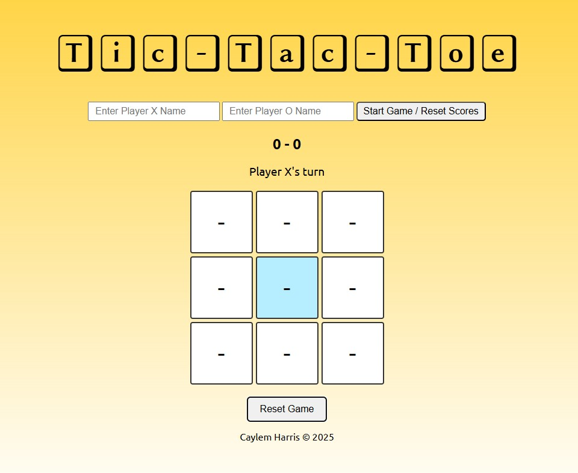

# ODIN - Javascript Course
## Project: Tic-Tac-Toe Solution

This is a solution to the [Project: Tic-Tac-Toe Solution from The ODIN Project](https://www.theodinproject.com/lessons/node-path-javascript-tic-tac-toe).
## Table of contents

- [Overview](#overview)
  - [Screenshot](#screenshot)
  - [Links](#links)
- [My process](#my-process)
  - [Built with](#built-with)
  - [What I learned](#what-i-learned)
  - [Next Enhancements](#next-enhancements)
- [Author](#author)

## Overview
A browser-based Tic-Tac-Toe game with:
- Dynamic player names
- Scoreboard
- Win/tie detection
- Winning cell highlight
- Reset functionality
- Mobile responsive design

### Screenshot

### Links

- Live Site URL: [Play Tic-Tac-Toe](https://caylemh.github.io/odin-tic-tac-toe/)

## My process

I started by determining the objectives and outcomes for the project before writing a line of code. Once those were determined I moved onto how the game would be developed; from logic to UI. 

This process started by implementing the modules and IIFEs (GameBoard Module, Player Factory Function and GameController Module) that I would use to create the game.

An understanding of the Gameflow was crucial as not to complicate things:
Gameplay Flow
----------------
1. Player enters names and clicks Start Game
2. Board displays 3x3 grid, Player X goes first
3. Players click empty cells to place markers
4. After each move: update board, check winner/tie, switch player
5. Display winner, highlight winning cells, update scores
6. Click Reset Game to start a new round

I then proceeded to first coding a Console Version of the game as make sure that the logic and background processes work before I began building the UI using HTML and CSS.

### Built with

- Semantic HTML5 markup
- Vanilla CSS
- Javascript (Modular)

### What I learned

I learnt the implementation of OOP Principles in Javascript using Modules and IIFEs (Immediately Invoked Factory Expressions).

I also tried to implement best-practices:
  - Modules & factory functions - encapsulate board and players
  - Event delegation - clean click handling
  - Separation of concerns - board handles state, controller handles logic/UI
  - Dynamic DOM updates - message, scores, highlights
  - Responsive design - mobile playable

### Next Enhancements
  - Tie counter
  - Restart round without clearing scores
  - AI player / single-player mode
  - Animations for marker placement
  - Customizable themes/colors

## Author

- Github - [caylemh](https://github.com/caylemh/odin-tic-tac-toe)